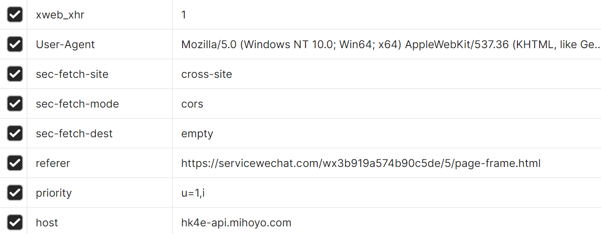
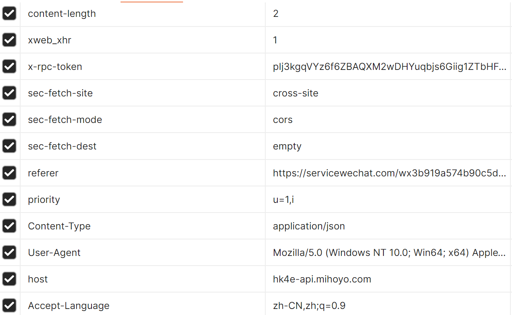

鸣谢：[UIGF-org/mihoyo-api-collect 提供mihoyo的api参考](https://github.com/UIGF-org/mihoyo-api-collect)，
[Womsxd/MihoyoBBSTools 绝大部分签到内容由python转写为Java](https://github.com/Womsxd/MihoyoBBSTools)，
[Android/Material3 组件样式](https://github.com/material-components/material-components-android)，
[gzu-liyujiang/Android_CN_OAID 部分Android信息获取](https://github.com/gzu-liyujiang/Android_CN_OAID)
[com.geetest.sensebot » sensebot 极验验证码](https://mvnrepository.com/artifact/com.geetest.sensebot/sensebot/4.3.3)
[MikeOrtiz/TouchImageView 图片查看器](https://github.com/MikeOrtiz/TouchImageView)
[yalantis/ucrop 图片裁剪](https://github.com/Yalantis/uCrop)
还有Google Android组件支持

非常非常简陋的APP，运行速度也非常缓慢。应该没人用（，写来玩的

由于鄙人不会设计，页面也做的比较丑（尽管使用了material3）

功能：

1. 米游社一键每日签到任务（包含米游币和游戏的签到）
2. 抽卡链接获取功能（登录后直接获取原神和绝区零的，可通过云游戏获取原神和星铁的）
    * 应该不会加分析了，直接导入到微信小程序吧

<mark>可以提功能，但是大概率不会加（</mark>

有bug也凑合用吧，提出来可能会解决？

---

原本想调一个后台运行的，结果验证码似乎不太好搞，那就不搞了（，等个一分钟应该也算可以了🤔有空整理一下屎山代码

---

原本想加一个微信原神小程序的，结果发现要code，就懒得再搞了，这里mark一下有兴趣的可以看看：

* GET https://hk4e-api.mihoyo.com/event/doorman/v1/event/wechat_shop/wechatmp/exchange?app=event&client_name=wechat_shop&platform=wechatmp&code=
    * 后面的code可能是微信小程序的code？
    * header：
      
    * 返回值
```json
{
  "retcode": 0,
  "message": "OK",
  "data": {
    "token": "nuzYa67o"
  }
}
```    

* POST https://hk4e-api.mihoyo.com/event/weixinpointsmall/sign
    * header中需要添加刚刚返回的token -> x-rpc-token:
    * header：
      
    * 返回值
```json
{
  "retcode": 0,
  "message": "OK",
  "data": {
    "coin": 5,
    "total_coin": 825,
    "tasks": [
      {
        "task_config_id": 1001,
        "status": "TS_DONE",
        "desc": "3",
        "icon": "https://fastcdn.mihoyo.com/static-resource-v2/2024/06/14/881b6e74975a2989f0a119427871e5be_3617327020012540585.png",
        "icon_detail": "https://fastcdn.mihoyo.com/static-resource-v2/2024/06/14/3eb599a723bfe9ef09e6fc478c8262d0_9119262560095512903.png",
        "award_desc": "摩拉×20000"
      },
      {
        "task_config_id": 1002,
        "status": "TS_DONE",
        "desc": "5",
        "icon": "https://fastcdn.mihoyo.com/static-resource-v2/2024/06/14/ebf1ca1f83d719c1778b8d01fb0e8115_1027578354241986805.png",
        "icon_detail": "https://fastcdn.mihoyo.com/static-resource-v2/2024/06/14/8a979fd2e075e5f60959a4d8f5dfc536_7772729234138631324.png",
        "award_desc": "甜甜花酿鸡×3"
      },
      {
        "task_config_id": 1003,
        "status": "TS_DOING",
        "desc": "7",
        "icon": "https://fastcdn.mihoyo.com/static-resource-v2/2024/06/14/1ae7961356e21dfe3d8f3b66b67ba852_6570677886805205025.png",
        "icon_detail": "https://fastcdn.mihoyo.com/static-resource-v2/2024/06/14/ddcb604c9085c4b7357e278fd76aa573_7905595052265201036.png",
        "award_desc": "冒险家的经验×5"
      },
      {
        "task_config_id": 1004,
        "status": "TS_DOING",
        "desc": "9",
        "icon": "https://fastcdn.mihoyo.com/static-resource-v2/2024/06/14/881b6e74975a2989f0a119427871e5be_3617327020012540585.png",
        "icon_detail": "https://fastcdn.mihoyo.com/static-resource-v2/2024/06/14/e662b4cd949e7ad23967d65962468a0e_7919866827787859077.png",
        "award_desc": "大英雄的经验×3"
      }
    ],
    "sign_days": 5,
    "continue_sign_days": 5
  }
}
```

---

本来还想加一个米游社里战绩功能的，抓不到，懒了，不搞了（

---

2026新年新气象，见鬼了怎么能写出这么屎的代码

---

突然发现被自己手机识别成病毒了…关键还不说具体是哪个东西，估摸着应该是OAID库的原因，调整一下看看先。谁知道Android.Riskware.Gray.VPN.B.YYTS这个是啥问题可以可以和俺说一声（